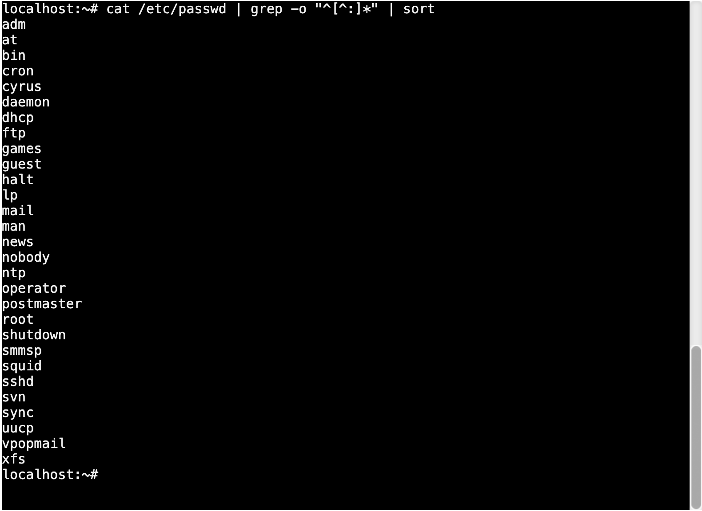
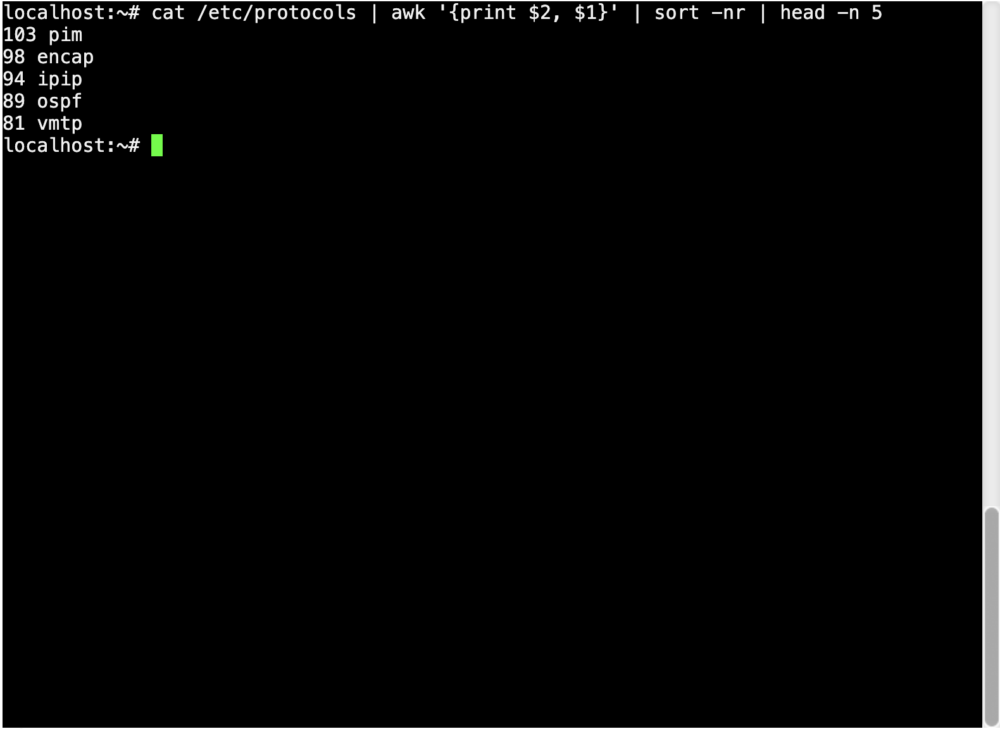
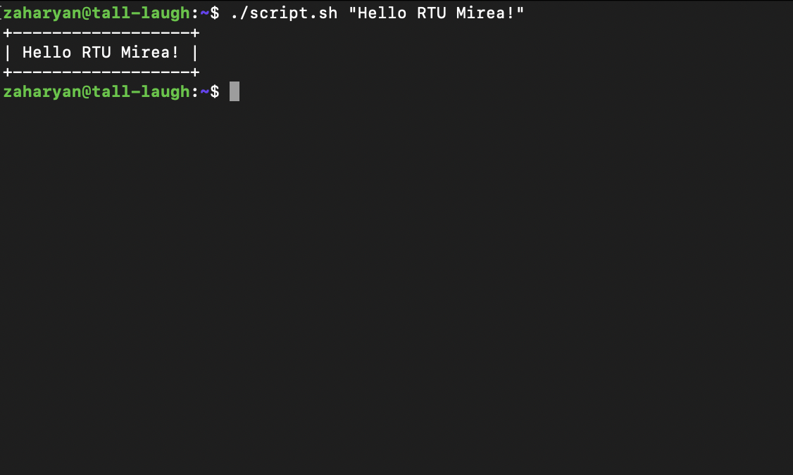
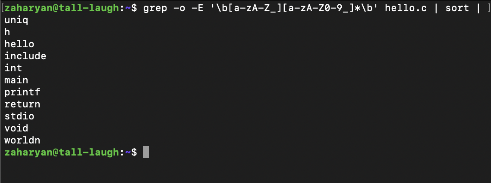
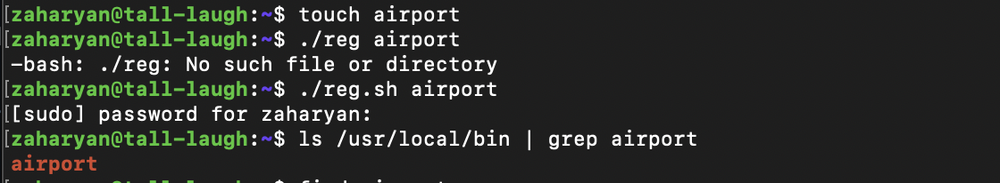
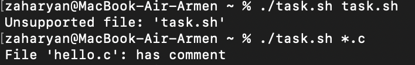
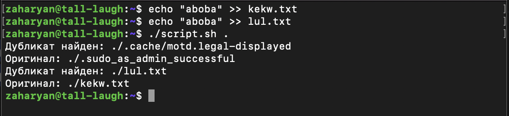
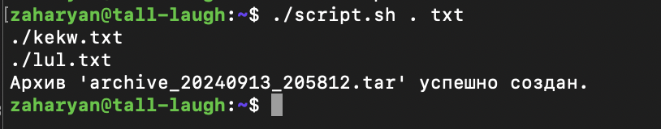
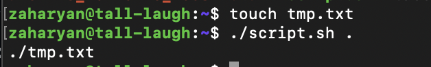

## Задание 1
```bash
cat /etc/passwd | grep -o "^[^:]*" | sort
```
### Результат

## Задание 2
```bash
cat /etc/protocols | awk '{print $2, $1}' | sort -nr | head -n 5
```
### Результат

## Задание 3
```bash
#!/bin/bash
len=${#1}
str=$1
upper="-"
side="|"
printf "+"
printf "%0.s$upper" $(seq 1 $(expr $len + 2))
printf "+\n"
printf "$side $str $side\n"
printf "+"
printf "%0.s$upper" $(seq 1 $(expr $len + 2))
printf "+\n"
```
### Результат


## Задание 4
```bash
grep -o -E '\b[a-zA-Z_][a-zA-Z0-9_]*\b' hello.c | sort | uniq
```
### Результат


## Задание 5
```bash
#!/bin/bash
 
chmod +x $1
sudo cp $1 /usr/local/bin
```
### Результат


## Задание 6

```bash
#!/bin/bash

file=$1
extension="${file##*.}"
first=$(head -n 1 $file)

case "$extension" in
    c|js)
        if [[ $first =~ ^\s*// ]]; then
            echo "File '$file': has comment"
            exit
        fi
        ;;
    py)
        if [[ $first =~ ^\s*# ]]; then
            echo "File '$file': has comment"
            exit
        fi
        ;;
    *)
        echo "Unsupported file: '$file'"
        exit
        ;;
    esac
echo "File '$file' has no comments"
```
### Результат


## Задание 7

```bash
#!/bin/bash
if [[ -z "$1" ]]; then
    echo "Использование: $0 <путь>"
    exit 1
fi

search_path="$1"

declare -A file_hashes

find "$search_path" -type f -print0 | while IFS= read -r -d '' file; do
    file_hash=$(md5sum "$file" | awk '{ print $1 }')
    
    if [[ -n "${file_hashes[$file_hash]}" ]]; then
        echo "Дубликат найден: $file"
        echo "Оригинал: ${file_hashes[$file_hash]}"
    else
        file_hashes[$file_hash]="$file"
    fi
done
```
### Результат


## Задание 8
```bash
#!/bin/bash

if [[ $# -ne 2 ]]; then
    echo "Использование: $0 <путь_к_директории> <расширение>"
    exit 1
fi

directory="$1"
extension="$2"

if [[ ! -d "$directory" ]]; then
    echo "Ошибка: Директория '$directory' не существует."
    exit 1
fi

archive_name="archive_$(date +%Y%m%d_%H%M%S).tar"

find "$directory" -type f -name "*.$extension" -print0 | tar --null -cvf "$archive_name" --files-from -

echo "Архив '$archive_name' успешно создан."
```
### Результат


## Задание 9
```bash
#!/bin/bash

if [[ $# -ne 2 ]]; then
    echo "Использование: $0 <входной_файл> <выходной_файл>"
    exit 1
fi

input_file="$1"
output_file="$2"

if [[ ! -f "$input_file" ]]; then
    echo "Ошибка: Входной файл '$input_file' не существует."
    exit 1
fi

sed 's/    /\t/g' "$input_file" > "$output_file"

echo "Замена завершена. Результат сохранен в '$output_file'."
```
### Результат


## Задание 10
```bash
#!/bin/bash

if [[ $# -ne 1 ]]; then
    echo "Использование: $0 <путь_к_директории>"
    exit 1
fi

directory="$1"

if [[ ! -d "$directory" ]]; then
    echo "Ошибка: Директория '$directory' не существует."
    exit 1
fi

find "$directory" -type f -name "*.txt" -size 0 -print
```
### Результат

