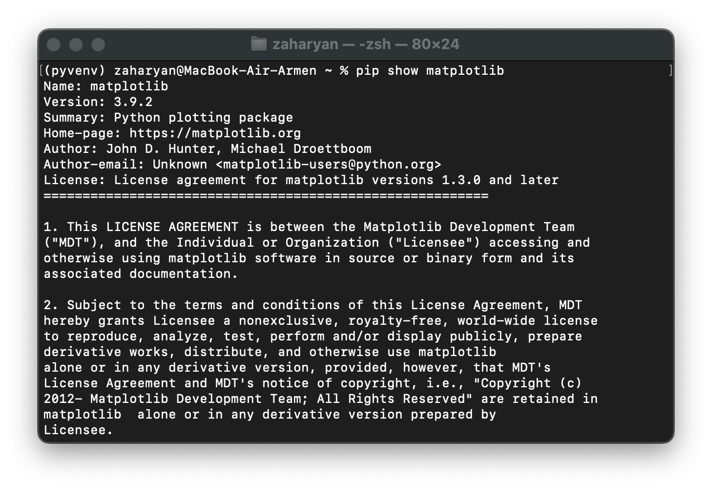
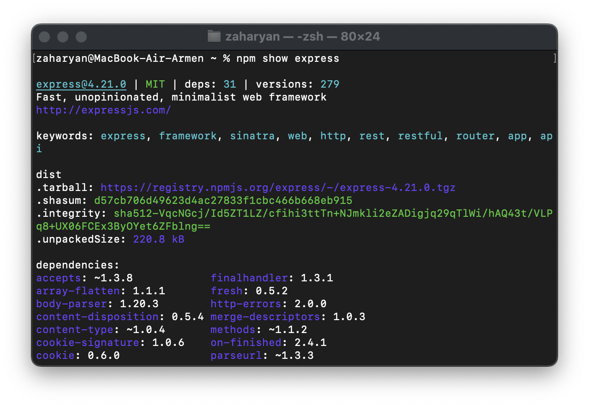
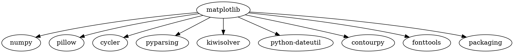
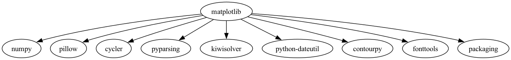
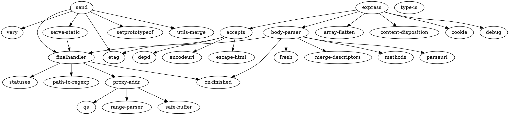
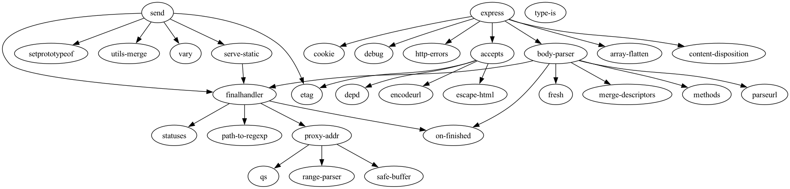
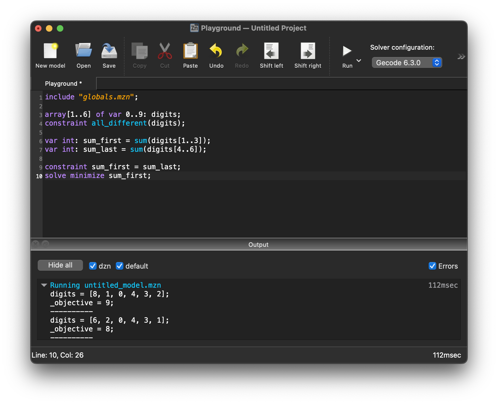
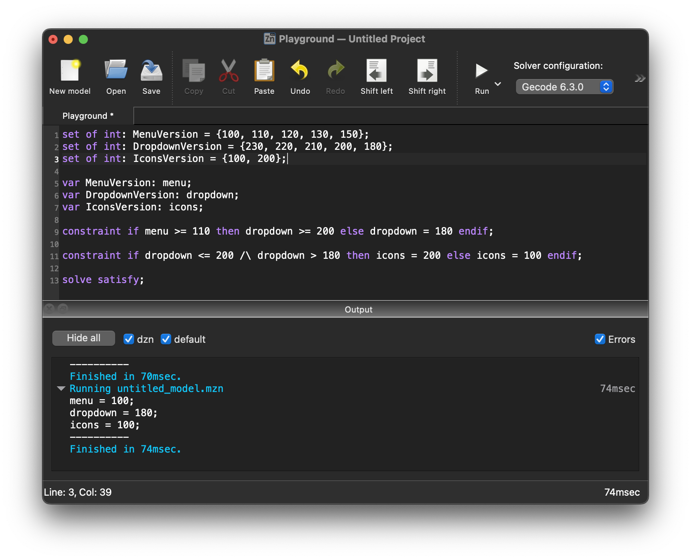
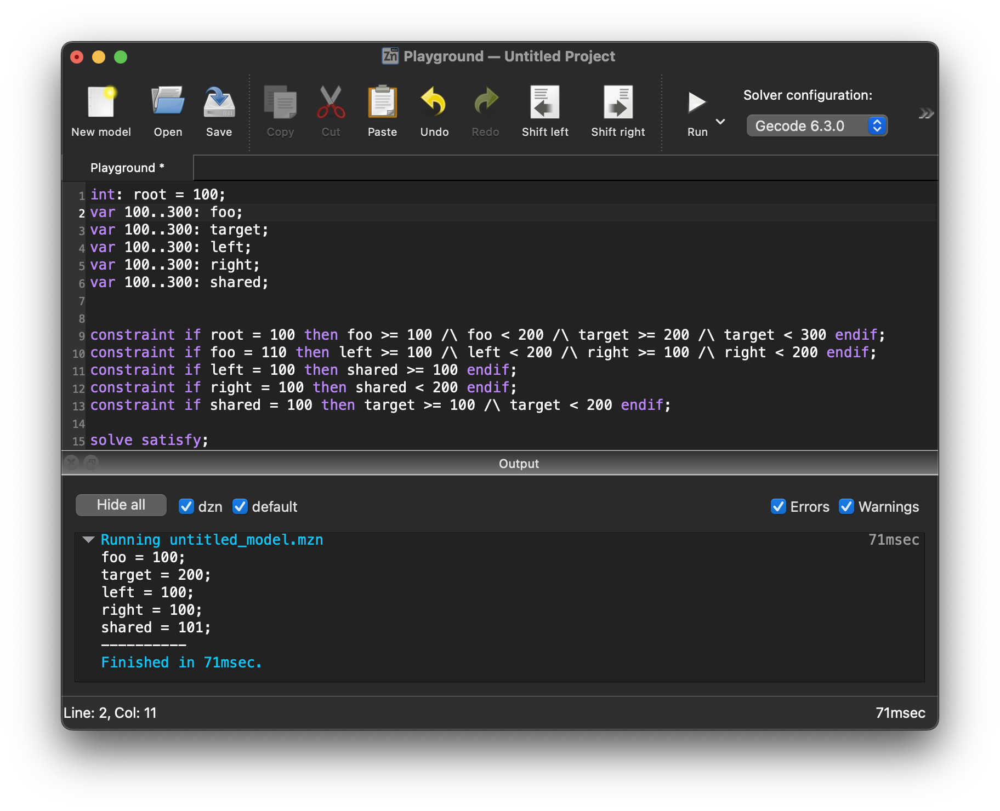

## Задание 1
- Вывод информации о пакете
```bash
pip show matplotlib
```
### Результат


- Установка из репозитория
```bash
git clone https://github.com/matplotlib/matplotlib.git
cd matplotlib
pip install .
```
## Задание 2
```bash
npm show express
```
### Результат


- Установка из репозитория
```bash
git clone https://github.com/expressjs/express.git
cd express
npm install
```
## Задание 3
`matplot.dot:`

 - Рендер изображения
```bash
dot -Tpng matplot.dot -o matplot.png
```
### Результат


`express.dot`



- Рендер изображения
```bash
dot -Tpng express.dot -o express.png
```
### Результат


## Задание 4
```minizinc
include "globals.mzn";

array[1..6] of var 0..9: digits;
constraint all_different(digits);

var int: sum_first = sum(digits[1..3]);
var int: sum_last = sum(digits[4..6]);

constraint sum_first = sum_last;
solve minimize sum_first;
```
### Результат


## Задание 5
```minizinc
set of int: MenuVersion = {100, 110, 120, 130, 150};
set of int: DropdownVersion = {230, 220, 210, 200, 180};
set of int: IconsVersion = {100, 200};

var MenuVersion: menu;
var DropdownVersion: dropdown;
var IconsVersion: icons;

constraint if menu >= 110 then dropdown >= 200 else dropdown = 180 endif;

constraint if dropdown <= 200 /\ dropdown > 180 then icons = 200 else icons = 100 endif;

solve satisfy;
```
### Результат


## Задание 6

```minizinc
int: root = 100;
var 100..300: foo;
var 100..300: target;
var 100..300: left;
var 100..300: right;
var 100..300: shared;


constraint if root = 100 then foo >= 100 /\ foo < 200 /\ target >= 200 /\ target < 300 endif;
constraint if foo = 110 then left >= 100 /\ left < 200 /\ right >= 100 /\ right < 200 endif;
constraint if left = 100 then shared >= 100 endif;
constraint if right = 100 then shared < 200 endif;
constraint if shared = 100 then target >= 100 /\ target < 200 endif;

solve satisfy;
```
### Результат

