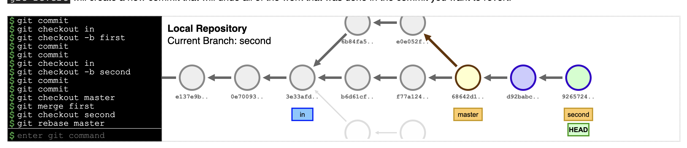

# Задание 1

### Код

```python
import json

def generate_makefile(dependencies):
    with open("Makefile", "w") as f:
        for task, deps in dependencies.items():
            f.write(f"{task}: {' '.join(deps)}\n")
            f.write(f'\t@echo "Processing {task}."\n')
        f.write("\n\t@echo 'All tasks completed!'\n")

def main():
    with open("civgraph.json", "r") as file:
        dependencies = json.load(file)
    
    generate_makefile(dependencies)

if __name__ == "__main__":
    main()
```

### Вывод



# Задание 2
### Условие

Реализовать на Dhall приведенный ниже пример в формате JSON. Использовать в реализации свойство программируемости и принцип DRY.

### Код

```python

def generate_makefile(civgraph, output_file="Makefile"):
    with open(output_file, "w") as f:
        f.write("all: " + " ".join(civgraph.keys()) + "\n\n")

        for task, dependencies in civgraph.items():
            if dependencies:
                deps_str = " ".join(dependencies)
                f.write(f"{task}: {deps_str}\n")
            else:
                f.write(f"{task}:\n")
            f.write(f"\t@echo \"Task {task} is done.\"\n")
            f.write(f"\t@touch {task}\n\n")

def main():
    with open("civgraph.json", "r") as file:
        dependencies = json.load(file)
    
    generate_makefile(dependencies)

if __name__ == "__main__":
    main()

```

### Вывод


# Задание 3
### Код

```
import json

def generate_makefile(civgraph, output_file="Makefile"):
    with open(output_file, "w") as f:
        f.write("all: " + " ".join(civgraph.keys()) + "\n\n")
        for task, dependencies in civgraph.items():
            if dependencies:
                deps_str = " ".join(dependencies)
                f.write(f"{task}: {deps_str}\n")
            else:
                f.write(f"{task}:\n")
            f.write(f"\t@echo \"Task {task} is done.\"\n")
            f.write(f"\t@touch {task}\n\n")
        f.write("clean:\n")
        f.write(f"\t@rm -f {' '.join(civgraph.keys())}\n")
        f.write("\t@echo \"All tasks cleaned up, including the animal.\"\n")

def main():
    with open("civgraph.json", "r") as file:
        dependencies = json.load(file)
    
    generate_makefile(dependencies)

if __name__ == "__main__":
    main()
```

### Вывод


# Задание 4
### Код

```Makefile
CC = gcc
CFLAGS = -Wall
OUTPUT = prog

SOURCES = prog.c data.c
OBJECTS = prog.o data.o
ARCHIVE = distr.zip

all: $(OUTPUT)

$(OUTPUT): $(OBJECTS)
	$(CC) $(OBJECTS) -o $(OUTPUT)

prog.o: prog.c
	$(CC) $(CFLAGS) -c prog.c -o prog.o

data.o: data.c
	$(CC) $(CFLAGS) -c data.c -o data.o

archive: $(ARCHIVE)

$(ARCHIVE): $(OUTPUT) files.lst
	zip $(ARCHIVE) *.*

files.lst: $(OUTPUT)
	ls > files.lst

clean:
	rm -f $(OBJECTS) $(OUTPUT) files.lst $(ARCHIVE)
	@echo "Cleaned up."
```

### Вывод

